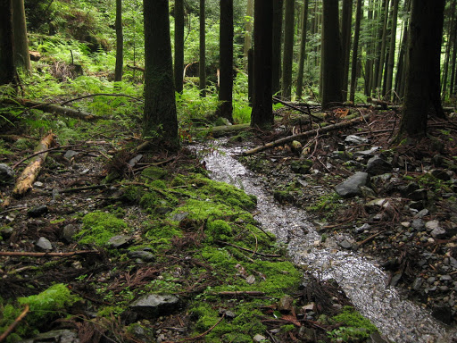
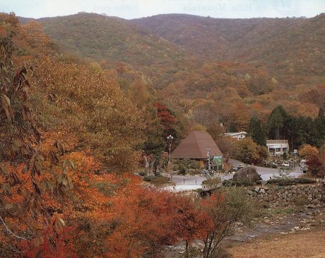
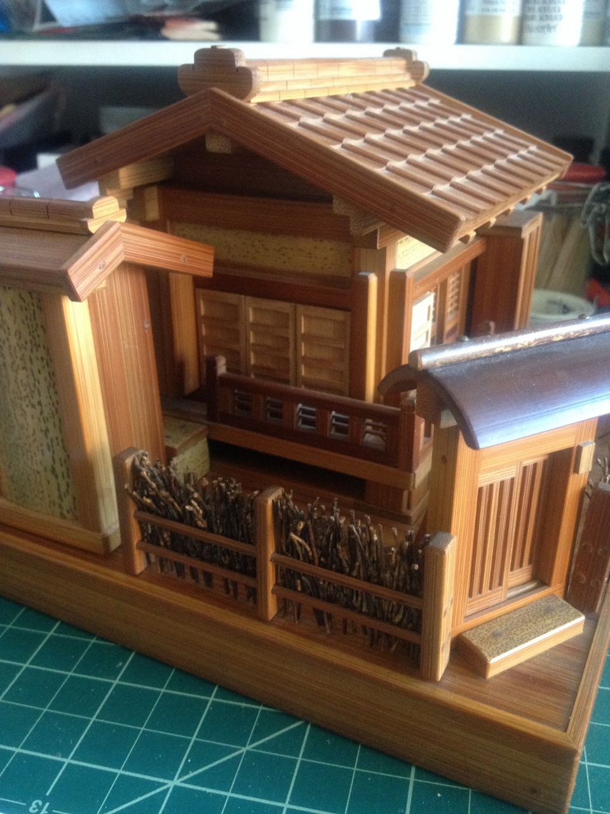
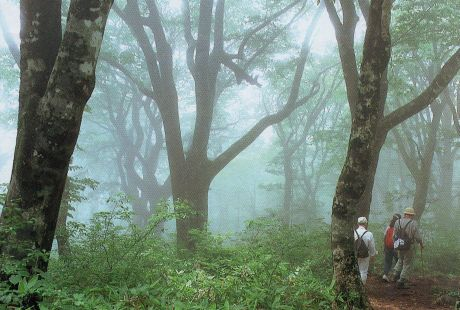
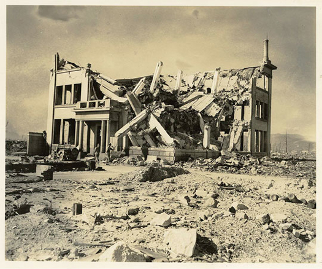
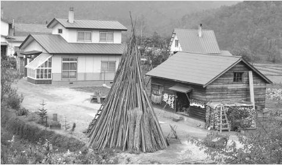
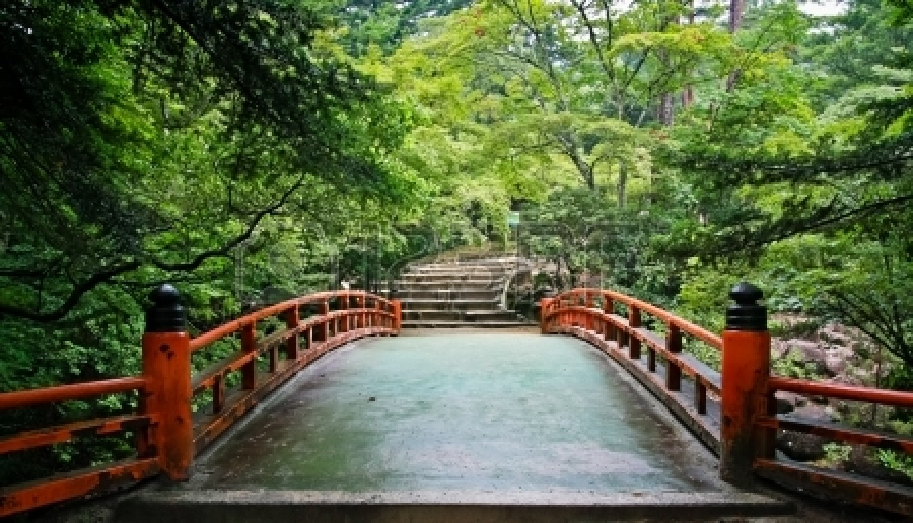
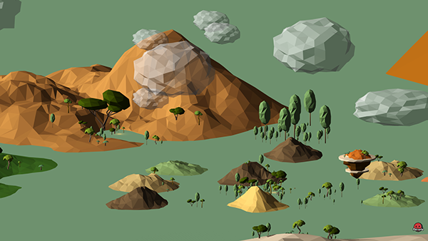
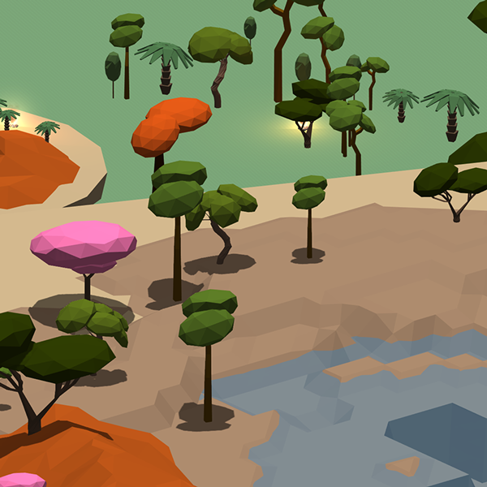

<h2>Environment</h2>

This directory contains links and information about the general environment of Japan, as well as the area of Hiroshima.

<h3>Geography of Japan</h3>

General knowledge I've gathered from <a href="http://en.wikipedia.org/wiki/Geography_of_Japan">Geography of Japan Wikipedia</a>:
<ul>
	<li><strong>Island</strong>
		<ul>
			<li>Island nation, with a stratovolcanic archipelago: meaning that the island is made up of steep, active volcanos with collapsed craters.</li>
			<li>3 major "Home Islands": Honshu (mainland), Shikoku, and Kyushu.</li>
			<li>Total size is roughly 11% smaller than the state of California</li>
		</ul>
	</li>
	<li><strong>Climate</strong>
		<ul>
			<li>Tropical to the south, cool to the north, Japan is a temperate zone and has all 4 seasons.</li>
			<li>Japan is a rainy country with high humidity</li>
			<li>Hiroshima (located in Honshu) is situated on the Ota river delta, divided by six channel inlets. It has a humid, subtropic climate with hot summers (but it still rains).</li>
		</ul>
	</li>
	<li><strong>Terrain</strong>
		<ul>
			<li>Japan is mostly rugged and mountainous, comparable to Norway in that 70% of the country is mountains.</li>
			<li>There is very little natural flat area that exists, so many hills and mountainsides are cultivated flat.</li>
			<li>Due to volcanos, hot springs are everywhere.</li>
		</ul>
	</li>
	<li><strong>Flora</strong>
		<ul>
			<li>5000 to 6000 species of plant occur naturally in Japan. Subtropical forest in the south, coniferous forest in the north.</li>
			<li>Hiroshima is in the south, populated by <a href="http://en.wikipedia.org/wiki/Mangrove" target="_blank">mangroves</a>,<a href="http://en.wikipedia.org/wiki/Cycad" target="_blank">Cyads</a>, and <a href="http://en.wikipedia.org/wiki/Cyatheales" target="_blank">Cyatheales (tree ferns)</a>.</li>
			<li>Southwest Honshu is dominated by broadleaved evergreen forests with oaks. The climate is cool-temperate with broad-leaved deciduous trees and Japanese beech trees.</li>
		</ul>
	</li>
</ul>

<h3>Environment Examples and Styles</h3>

An example of actual environment and polyworld style to draw inspiration from.

