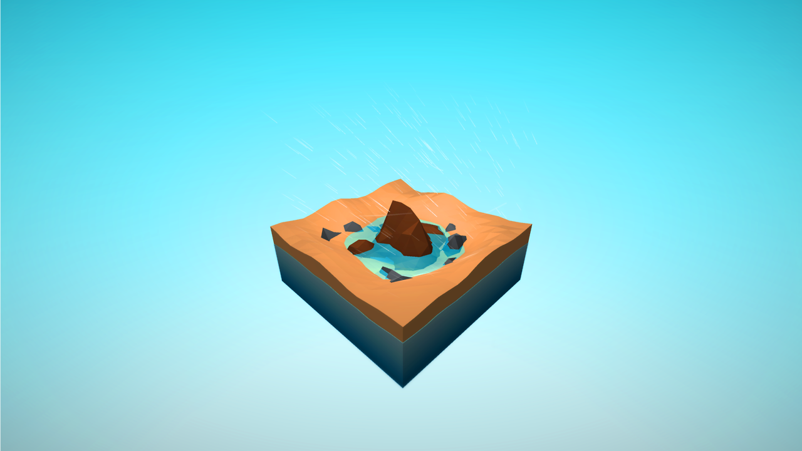
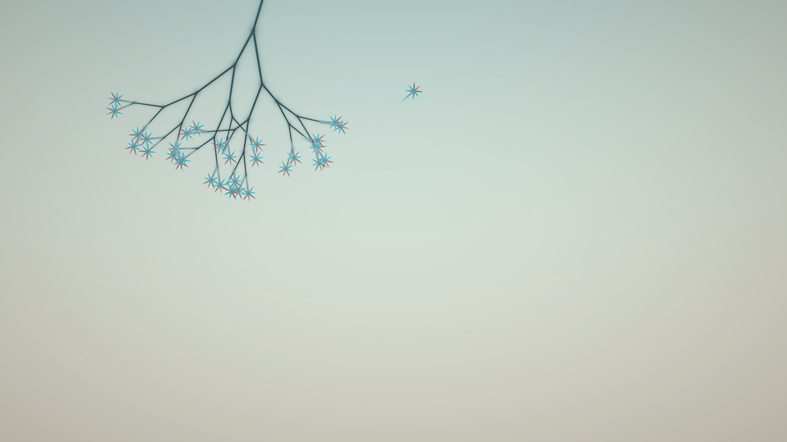
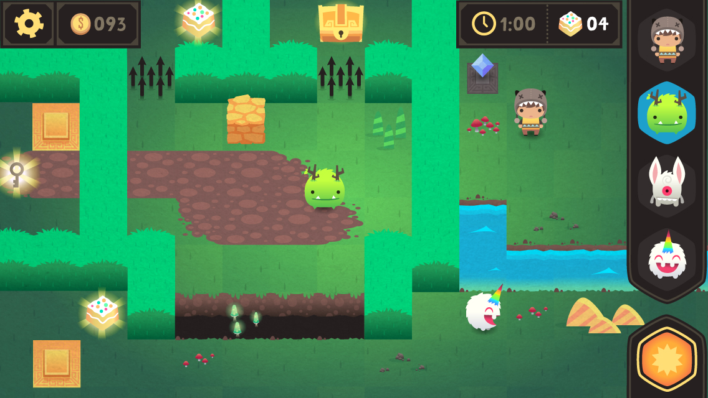
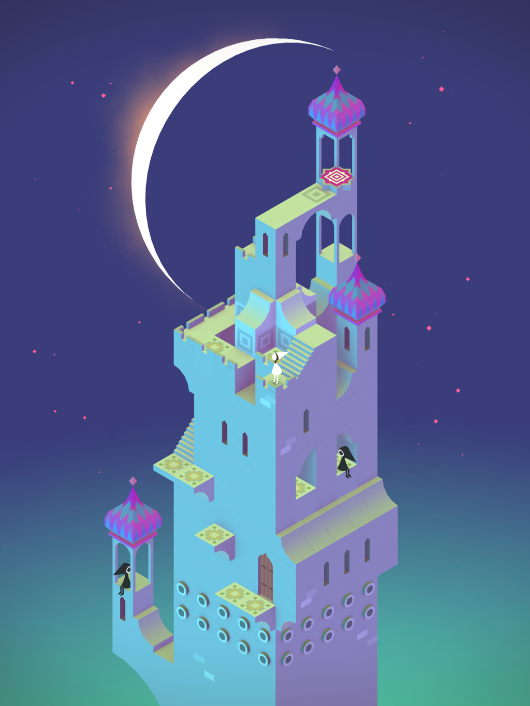
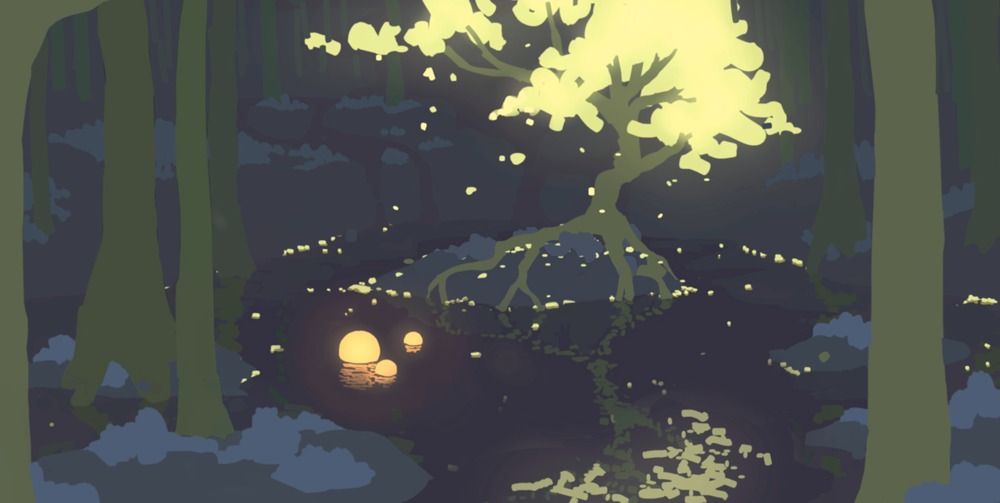
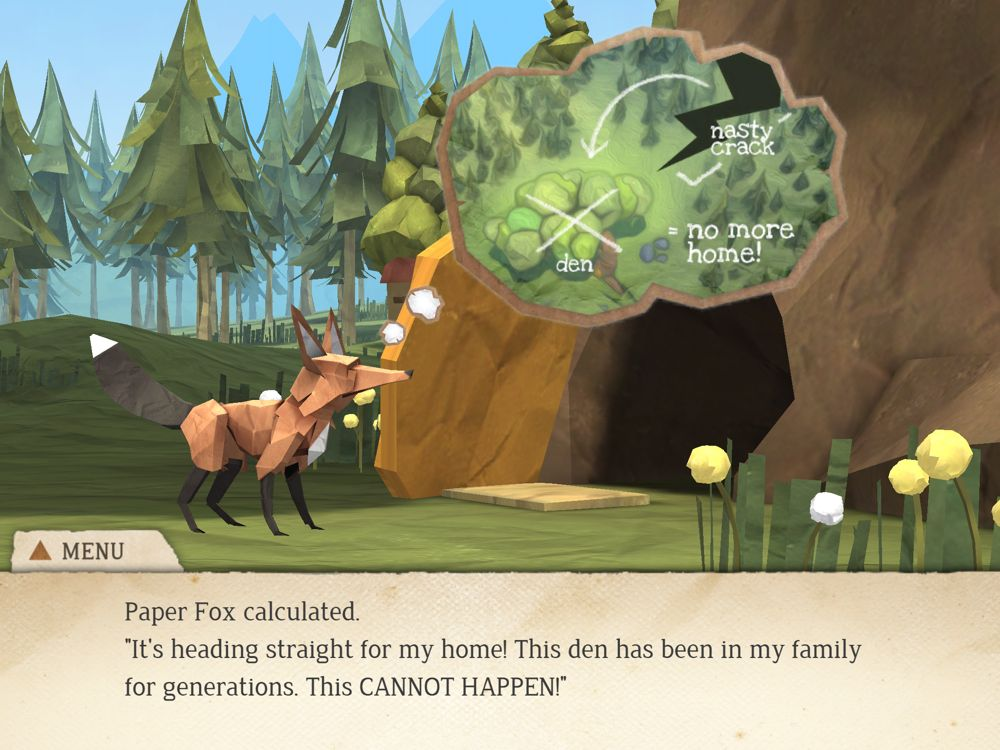
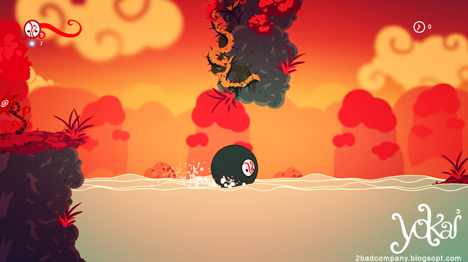

<h2>Styles</h2>

Included in this directory are snippits from games that are meant to insprire a style for our game

<h4>Biome</h4>

In particular the geometric look of this little piece of environment is subtle yet recognizable. I think treating the ground in such a way might be possible, but perhaps with not the same amount of depth as this.

<h4>Eufloria</h4>

More for mood than anything else, this game has a certain feel that I think might be useful for the way we handle lighting in the environment. This will be essential in conveying emotion through our game.

<h4>Monsters Ate My BirthdayCake </h4>

I threw this into the consideration pile because of the top-down, straight-forward (no viewable angles) treatment of this game that is similar to the camera we have been considering. The style is probably too cartoony, but it is interesting to see how things will look at this angle.

<h4>MonumentValley</h4>

This game is beautiful. I honestly want to try and create a style that "feels" like this. It's not entirely geometric, but it is something that I think I may be able to acheive. This is the look that I'll be shopping to the team but perhaps with a bit of a grittier look and more defined color shapes (there are many gradients of colors here that our environment can take care of instead).

<h4>Shape Of The World</h4>

This piece is thrown in mainly to suggest how minimalistic we can keep a color palette and still maintain detail with the environment. I will be developing a color palette that is very minimal like this.

<h4>ThePaperFox</h4>

While this is way too detailed for me to crank out in a quick timeframe, The overall style of objects will have a grit or feel of paper or paper objects

<h4>Yokai</h4>

I think I might be devloping a color palette that is very similar to this game. This game is brave in how bright its colors are but still keeps a minimal range of colors. This is an extreme example of how bright things can possibly be, perhaps we will be more low-key.
